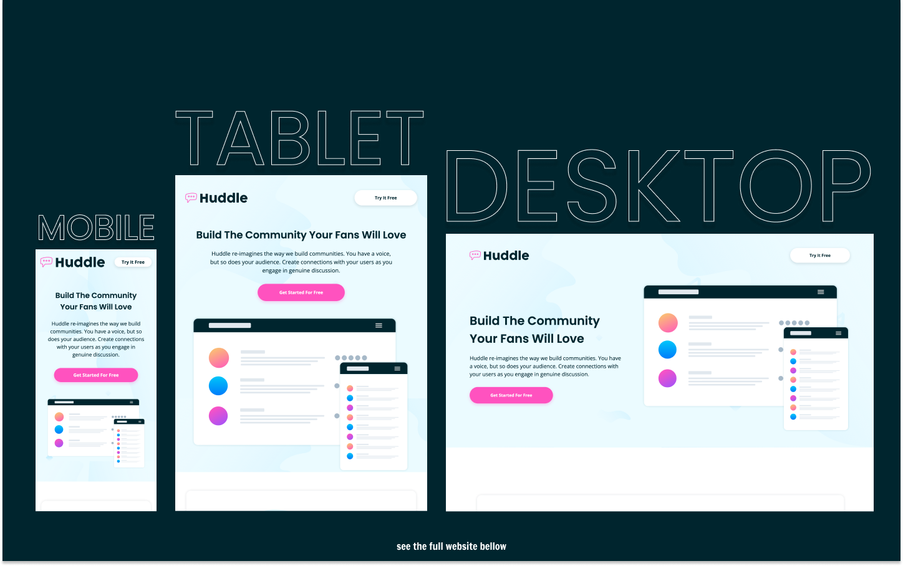

# Frontend Mentor - Huddle Landing Page with Alternating Feature Blocks Solution

This is a solution to the [Huddle Landing Page with Alternating Feature Blocks Challenge on Frontend Mentor](https://www.frontendmentor.io/challenges/huddle-landing-page-with-alternating-feature-blocks-5ca5f5981e82137ec91a5100).

## Table of contents

- [Overview](#overview)
  - [The challenge](#the-challenge)
  - [Screenshot](#screenshot)
  - [Links](#links)
- [My process](#my-process)
  - [Built with](#built-with)
  - [What I learned](#what-i-learned)
  - [Useful resources](#useful-resources)
- [Author](#author)

## Overview

### The challenge

Users should be able to:

- View the optimal layout for the site depending on their device's screen size
- See hover states for all interactive elements on the page

### Screenshot

### Links

- Live Site URL: [https://kens-visuals.github.io/huddle-landing-page-with-blocks/](https://kens-visuals.github.io/huddle-landing-page-with-blocks/)
- Solution URL: [https://www.frontendmentor.io/solutions/huddle-landing-page-with-blocks-built-with-scss-bem-and-vanilla-js-Z6zhfo-X8](https://www.frontendmentor.io/solutions/huddle-landing-page-with-blocks-built-with-scss-bem-and-vanilla-js-Z6zhfo-X8)

## My process

### Built with

- Semantic HTML5 markup
- SCSS custom properties
- CSS Flexbox
- CSS Grid
- Vanilla JS
- Mobile-first workflow

### What I learned

There's not much to say about this project, other than it was really fun to put together. I like such projects where you can take a full control of BEM methodology. For example, the blocks in the middle section are identical, the only difference is when on the desktop layout one of them is reversed. So by adding a modifier class, one can easily change it. Till the end of the year, 3 projects left to do. On to the next one!

### Useful resources

- [CSS Box Shadows](https://getcssscan.com/css-box-shadow-examples) - My go to CSS box shadows collection.

## Author

- Frontend Mentor - [@kens-visuals](https://www.frontendmentor.io/profile/kens-visuals)
- Codewars - [@kens_visuals](https://www.codewars.com/users/kens_visuals)
- CodePen - [@kens-visuals](https://codepen.io/kens-visuals)
